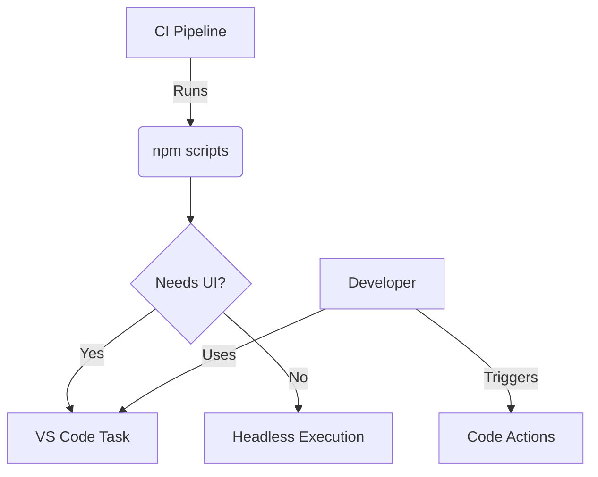

# VS Code Package.json Scripts, Tasks, and Code Actions Guide

## Executive Summary: Empowering Developers with Code Actions in Roo Code Generation

Integrating code actions into Roo code generation directly benefits developers by transforming it into a more powerful and efficient tool. Code actions offer context-sensitive operations within the code editor, providing developers with:

- **Boosted Productivity**: Generate relevant code snippets directly in context, eliminating manual boilerplate and accelerating development.
- **Interactive Refinement**: Instantly modify and improve generated code within the editor, fostering an iterative and user-guided process for optimal results.
- **Enhanced Usability**: Easily discover and access Roo's code generation features through intuitive editor UI elements, making the tool more accessible and user-friendly.
- **Seamless Tooling**: Leverage existing tools like read_file, search_files, etc., within code actions to create powerful, automated code generation workflows.
- **Improved Code Quality**: Generate contextually aware and refined code, leading to better alignment with project needs, reduced manual adjustments, and enhanced code consistency.

By embedding code actions, Roo Code becomes a more intuitive and indispensable asset for developers, streamlining workflows, accelerating development cycles, and ultimately improving code quality and developer satisfaction.

# Table Of Contents

- [VS Code Package.json Scripts, Tasks, and Code Actions Guide](#vs-code-packagejson-scripts-tasks-and-code-actions-guide)
  - [Executive Summary: Empowering Developers with Code Actions in Roo Code Generation](#executive-summary-empowering-developers-with-code-actions-in-roo-code-generation)
- [Table Of Contents](#table-of-contents)
  - [Automation Strategy](#automation-strategy)
    - [When to Use Which Tool](#when-to-use-which-tool)
  - [Available Automations Reference](#available-automations-reference)
    - [NPM Scripts (package.json)](#npm-scripts-packagejson)
      - [Build Scripts](#build-scripts)
      - [Test Scripts](#test-scripts)
      - [Quality Scripts](#quality-scripts)
      - [Type Checking](#type-checking)
      - [Development Workflow](#development-workflow)
      - [Git Hooks](#git-hooks)
    - [VS Code Tasks (.vscode/tasks.json)](#vs-code-tasks-vscodetasksjson)
      - [Build Tasks](#build-tasks)
      - [Test Tasks](#test-tasks)
      - [Linting Tasks](#linting-tasks)
      - [Python Tasks (via ms-python.python)](#python-tasks-via-ms-pythonpython)
      - [Custom Tasks](#custom-tasks)
    - [Code Actions (settings.json)](#code-actions-settingsjson)
      - [JavaScript/TypeScript (ESLint)](#javascripttypescript-eslint)
      - [Python (Ruff, Pylint, isort, Pylance)](#python-ruff-pylint-isort-pylance)
      - [YAML (vscode-yaml)](#yaml-vscode-yaml)
      - [Markdown (markdown-all-in-one)](#markdown-markdown-all-in-one)
      - [Formatting (Prettier)](#formatting-prettier)
      - [General Code Actions](#general-code-actions)
  - [SonarLint Integration](#sonarlint-integration)
    - [SonarLint Code Actions](#sonarlint-code-actions)
    - [SonarLint Context Menu Actions](#sonarlint-context-menu-actions)
    - [SonarLint Automatic Analysis](#sonarlint-automatic-analysis)
    - [SonarLint Command Palette Actions](#sonarlint-command-palette-actions)
    - [SonarLint VS Code Tasks](#sonarlint-vs-code-tasks)
  - [Version History](#version-history)
    - [v1.0.0 (2025-01-25)](#v100-2025-01-25)

## Automation Strategy

### When to Use Which Tool

| Automation Type   | Location           | Use Cases                    |
| ----------------- | ------------------ | ---------------------------- |
| **npm Scripts**   | package.json       | • CI/CD pipelines            |
|                   |                    | • Cross-editor compatibility |
|                   |                    | • Complex workflows          |
| **VS Code Tasks** | .vscode/tasks.json | • IDE-integrated workflows   |
|                   |                    | • Background processes       |
|                   |                    | • Problem matching           |
| **Code Actions**  | settings.json      | • Editor-specific fixes      |
|                   |                    | • Quick implementations      |
|                   |                    | • Lint integrations          |

**Key Decision Criteria:**

1. Use npm scripts for:

   - Environment-agnostic task definitions
   - Composite command sequences
   - Workspace root operations

2. Use VS Code tasks for:

   - Enhanced editor integration
   - Output parsing/matchers
   - Keyboard shortcuts/UI access

3. Use Code Actions for:
   - Context-aware quick fixes
   - Language service integrations
   - Editor-specific optimizations

**Example Flow:**



## Available Automations Reference

### NPM Scripts (package.json)

These scripts can be run using `npm run <script-name>`.

#### Build Scripts

- `build`: Production build using webpack
- `build:dev`: Development build using webpack
- `build:debug`: Development build with debug configuration
- `watch`: Development build with watch mode

#### Test Scripts

- `test`: Run Jest tests
- `test:e2e`: Run end-to-end tests using Vitest
- `test:watch`: Run tests in watch mode
- `test:coverage`: Run tests with coverage reporting
- `test:all`: Run all tests including E2E

#### Quality Scripts

- `lint`: Run ESLint checks
- `format:check`: Check formatting with Prettier
- `format`: Fix formatting with Prettier
- `lint:markdown`: Run markdown linting
- `quality`: Run all quality checks (lint, format, markdown)

#### Type Checking

- `type-check`: Run TypeScript type checking
- `type-check:strict`: Run strict TypeScript checks
- `type-check:watch`: Run type checking in watch mode

#### Development Workflow

- `prepare`: Install Husky git hooks
- `setup`: Complete project setup
- `clean`: Remove build artifacts
- `reinstall`: Rebuild and reinstall VSCode extension
- `refresh`: Full rebuild and reinstall
- `validate`: Run all validation checks

#### Git Hooks

- `pre-commit`: Run before commits (lint-staged and type checks)
- `pre-push`: Run before pushing (full validation)

### VS Code Tasks (.vscode/tasks.json)

#### Build Tasks

- TypeScript Build
- Webpack Build
- Watch Mode

#### Test Tasks

- Run All Tests
- Run Current Test File
- Debug Current Test
- Coverage Report

#### Linting Tasks

- ESLint Check
- ESLint Fix
- Prettier Format
- Run All Quality Checks

#### Python Tasks (via ms-python.python)

- Run Python File
- Python: Run Test File
- Python: Debug Test File

#### Custom Tasks

- Export Problems
- Generate Documentation
- Clean Build

### Code Actions (settings.json)

#### JavaScript/TypeScript (ESLint)

```json
{
  "editor.codeActionsOnSave": {
    "source.fixAll.eslint": true
  }
}
```

#### Python (Ruff, Pylint, isort, Pylance)

```json
{
  "editor.codeActionsOnSave": {
    "source.fixAll.ruff": true,
    "source.fixAll.pylint": true,
    "source.organizeImports.python": true
  },
  "python.languageServer": "Pylance" // Ensure Pylance is enabled for full actions
}
```

- **Organize Imports (isort, Pylance)**: Automatically sorts and
  organizes Python imports.
- **Linting Fixes (Ruff, Pylint)**: Applies automatic fixes for
  linting errors.
- **Docstring Generation (autodocstring)**: Automatically generates
  docstring templates (trigger may vary).
- **Refactoring (Pylance)**: Offers various refactoring actions like
  rename, extract method, etc.

#### YAML (vscode-yaml)

```json
{
  "editor.codeActionsOnSave": {
    "source.fixAll.yaml": true // If supported by extension
  }
}
```

- **YAML Formatting/Validation**: Code actions for formatting and
  validating YAML files.

#### Markdown (markdown-all-in-one)

```json
{
  "editor.codeActionsOnSave": {
    "source.fixAll.markdown": true // If supported by extension
  },
  "markdown.extension.list.indentationSize": "adaptive" // Example setting
}
```

- **Markdown Formatting**: Code actions for formatting Markdown files
  (lists, headers, etc.).

#### Formatting (Prettier)

```json
{
  "editor.formatOnSave": true,
  "editor.defaultFormatter": "esbenp.prettier-vscode"
}
```

#### General Code Actions

- **Fix All**: Triggers all enabled code actions on save.
- **Organize Imports**: Command to manually organize imports (various languages).
- **Remove Unused Imports**: Command to remove unused imports (some languages).
- **Sort Imports**: Command to sort imports (available for some languages).
- **Rename Symbol**: Refactoring action to rename symbols (functions,
  variables, etc.).
- **Extract Method/Function**: Refactoring action to extract code blocks
  into new methods/functions.
- **Generate Docstrings**: Command or code action to generate documentation stubs.
- **Add Missing Imports**: Code action to automatically add missing imports.
- **Convert to Template Literal**: Code action to convert string
  concatenations to template literals in JavaScript/TypeScript.
- **Add Explicit Type Annotations**: Code action to add explicit type
  annotations in TypeScript.
- **Surround With**: Code action to surround code blocks with constructs
  like `if`, `try/catch`, etc.

- **Note**: Availability of specific code actions depends on the language,
  extensions installed, and their configurations. Check extension
  documentation for details.

## SonarLint Integration

### SonarLint Code Actions

SonarLint provides the following code actions, accessible directly in the editor:

1. **Quick Fixes**: Immediate, context-aware solutions for code smells, bugs, and
   security vulnerabilities.
2. **Rule Description**: In-editor explanations of SonarLint rules and best practices.
3. **Issue Suppression**: Options to suppress issues via comments or configuration.

### SonarLint Context Menu Actions

Right-clicking in the editor context menu provides these SonarLint actions:

1. **Show SonarLint Rule**: Opens documentation for the specific rule violation.
2. **Disable Rule**: Options to disable rules for the current line, file, or project.

### SonarLint Automatic Analysis

SonarLint offers automatic, real-time code analysis:

1. **Real-time Feedback**: Inline issue highlighting as you type.
2. **Full Project Scan**: Comprehensive quality overview through project-wide analysis.

### SonarLint Command Palette Actions

The following commands are available in the command palette (Ctrl+Shift+P or
Cmd+Shift+P, type "SonarLint"):

1. **`SonarLint: Analyze all project files`**: Triggers a manual, full project analysis.
2. **`SonarLint: Show all issues`**: Displays detected issues in the VS Code Problems
   panel.
3. **`SonarLint: Clean all issues`**: Clears the SonarLint issue list.
4. **`SonarLint: Show SonarLint output`**: Opens the SonarLint output panel.
5. **`SonarQube: Enable Verbose Logging`**: Turns on detailed logging.
6. **`SonarQube: Focus on Connected Mode View`**: Opens the Connected Mode view.
7. **`SonarQube: Connect to SonarQube Cloud`**: Connects to SonarQube Cloud.
8. **`SonarQube: Analyse current file ignoring excludes`**: Analyzes current file.
9. **`SonarQube: Bind workspace folders`**: Binds to SonarQube/SonarCloud.
10. **`SonarQube: Configure C/C++ compilation`**: Sets up C/C++ analysis.
11. **`SonarQube: Connect to Server`**: Connects to self-hosted SonarQube.
12. **`SonarQube: Focus on Help View`**: Opens Help and Feedback.
13. **`SonarQube: Focus on Rules View`**: Shows SonarQube rules browser.
14. **`SonarQube: Focus on Security View`**: Opens Security Hotspots view.
15. **`SonarQube: Reopen Local Issues`**: Reloads issues for current file.
16. **`SonarQube: Share feedback`**: Provides extension feedback.
17. **`SonarQube: Show Output`**: Opens SonarQube output panel.
18. **`View: Show SonarQube`**: Toggles SonarQube views.

### SonarLint VS Code Tasks

A dedicated VS Code task is configured for SonarLint project analysis:

- **Task Label**: `Analyze: SonarLint Project`
- **Purpose**: Runs a full SonarLint analysis on the entire project on demand.
- **Access**: Via `Tasks: Run Task` in the Command Palette.
- **Command**: `${command:SonarLint.analyzeAllFiles}`

## Version History

### v1.0.0 (2025-01-25)

- Initial unified documentation
- Automation strategy guide
- Comprehensive feature reference
- SonarLint integration details
