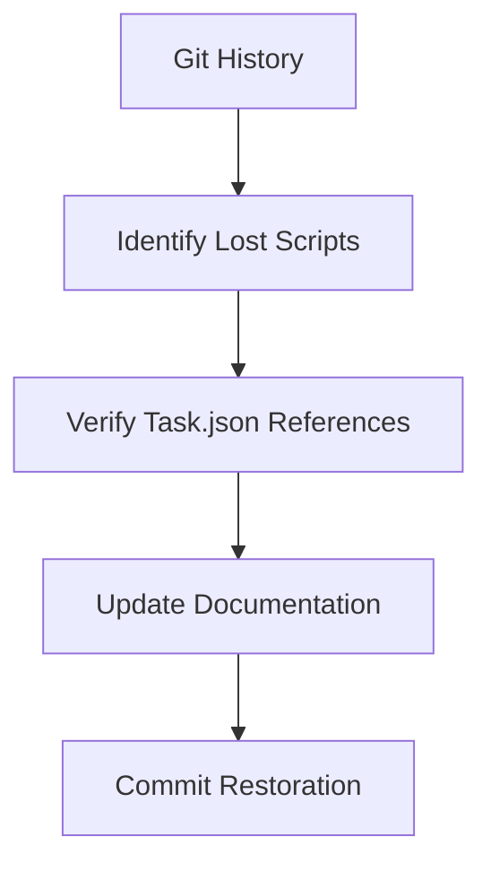

# VSCode Task System Architecture v2.1

## Historical Analysis Section

### Git History Recovery

```bash
# View package.json commit history
git log -p -- package.json

# Compare current vs last version
git diff HEAD~1 -- package.json

# Restore previous scripts
git checkout COMMIT_HASH -- package.json
```

### Script Lifecycle Tracking



## Preservation Guidelines

1. **Before Modifying Scripts**

```bash
git checkout -b script-update
git add package.json
git commit -m "Backup before script changes"
```

2. **Documentation Sync**

```markdown
| Script Name | Version Added | Last Modified | Purpose      |
| ----------- | ------------- | ------------- | ------------ |
| `validate`  | v0.1.0        | v2.0.0        | Quality gate |
```

3. **Archival Process**

```json
{
  "scriptRetention": {
    "policy": "Keep all historical versions",
    "backupLocation": "docs/script-history/"
  }
}
```
